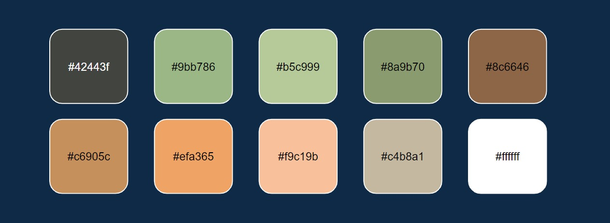
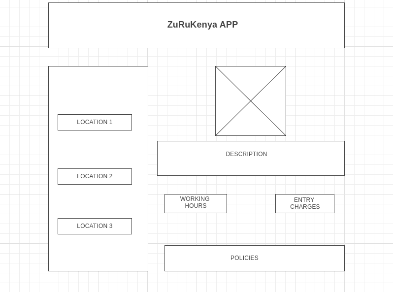
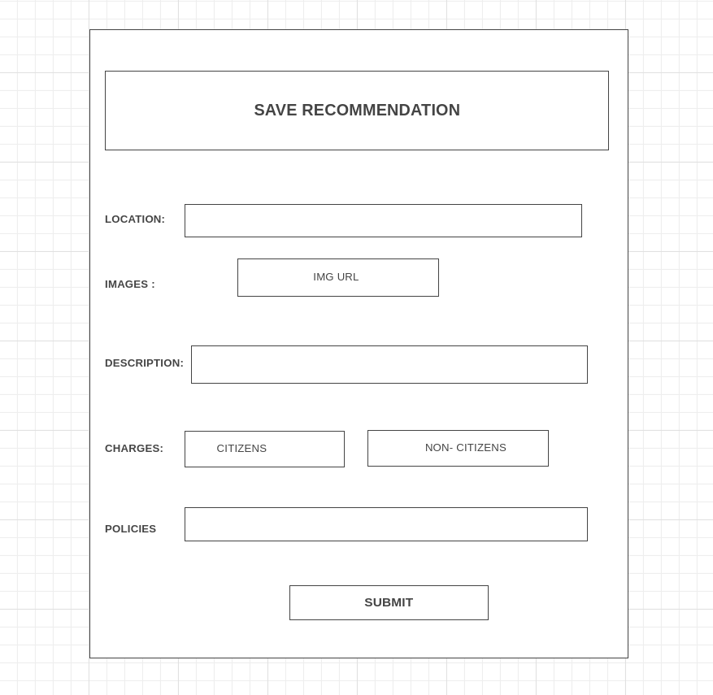

# ZuRuKenya Web APP

## Introduction
This project entails creating a travel directory Web application called ZuruKenya. It gives tourists recommendations of places to visit within Kenya. The app is meant to enlist tour recommendations and then tourists can view. A recommendation will include a photo, a description, charges, opening and closing hours, policies and amenities of the place to visit. The admin will be able to add these details on an admin form which will save on the server and the recommendation will show up in the web.

## The Client Side
The client side shows suggestions on different areas a user can visit within the country. An overview image of the tour location, entry fee charges, opening and closing hours and policies.

## Color Palette
The following is the chosen scheme:

## Fonts
The following are the fonts used for this project:

1. Nunito (Google Fonts)
1. Source Serif Pro (Google Fonts)

## Pages
The web application has the following pages:

#### The Client View Page

The client side shows suggestions on different areas a user can visit within the country. An overview image of the tour location, entry fee charges, opening and closing hours and policies.

#### The Site Update Form/view

The admin view shows the form template for the admin to add details to the recommendations on user view. 

## Definition of Terms
#### Location
This is the particular place suggested to visit.
#### Image
This is a link to an image that gives the general impression , represented by the location in form of a piece of art.
#### Description
This is an overview of the location in terms of the history of the place, what the person is likely to experience, see, and learn about the location.
#### Charges
This are the rates charged for entry to the location. Divided into citizen and non citizens, adults, students and children.
#### Policies
This are the rules or guidelines that a user is supposed to adhere to within the location or meet before they get to location.

